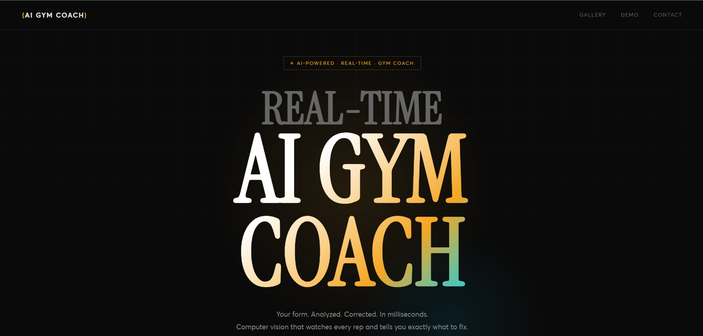

# Gym Coach UI

Modern and clean frontend for my AI-powered Real-time Gym Coach project.

Built with passion to deliver a smooth and attractive user experience.

## ✨ Features
- Responsive landing page with nice animations
- Interactive workout dashboard
- Exercise library with videos
- Clean, modern, and mobile-friendly design
- Built using HTML, CSS, and Vanilla JavaScript

## 📸 Screenshots

## 🚀 How to Run Locally
1. Clone the repository
2. Open `index.html` in your browser

## Demo
https://sam-gym-coach.netlify.app/